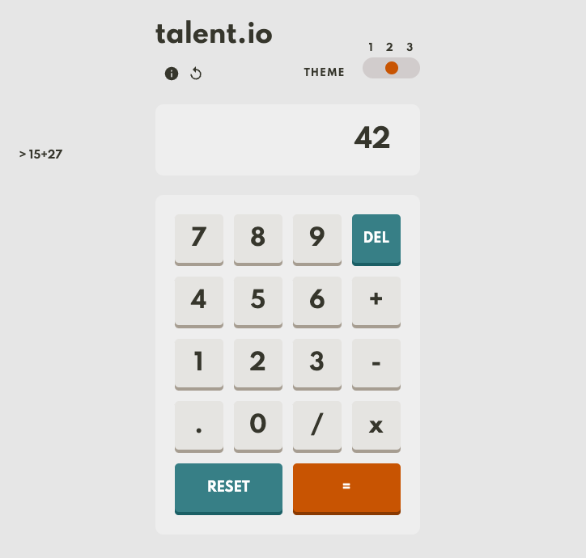
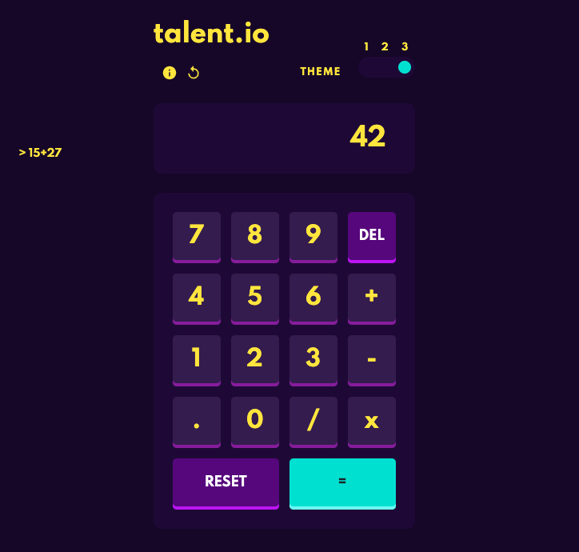

# talent.io | Calculator test

This is technical test for talent.io, you can see the challenge bellow. My project design and frontend was mainly inspired by [Dulranga Calculator Challenge](https://github.com/dulranga/Multi-Theme-Calculator).

## Screenshots

## Task
Create a single page application of a calculator using React.

If you don't know where to start, open the calculator of your smartphone.

## Must have

We will pay attention to the following points when reviewing your code:

- The code is clean and readable. ✔️
- It is possible to perform basic operations (`+` `-` `x` `/`). ✔️
- The calculator is well designed and user-friendly. ✔️

## Nice to have

For more points, feel free to pimp up the calculator. Here is a non-exhaustive list of features you could add:

- Show an history of the previous operations ✔️
- Add the possibility to use the numeric keys of your keyboard ✔️
- Add an undo/delete button ✔️
- Include an easter egg (use your creativity) ✔️
- Add a dark mode ✔️
- Add a demo page ✔️
- Make the app responsive ✔️
- Perform more complex operations (square, square root, log, etc...)
- Include tests in your code
- Anything you think of !

## Author

- Alexis Knob - [Website](https://www.bonko.fr/)
